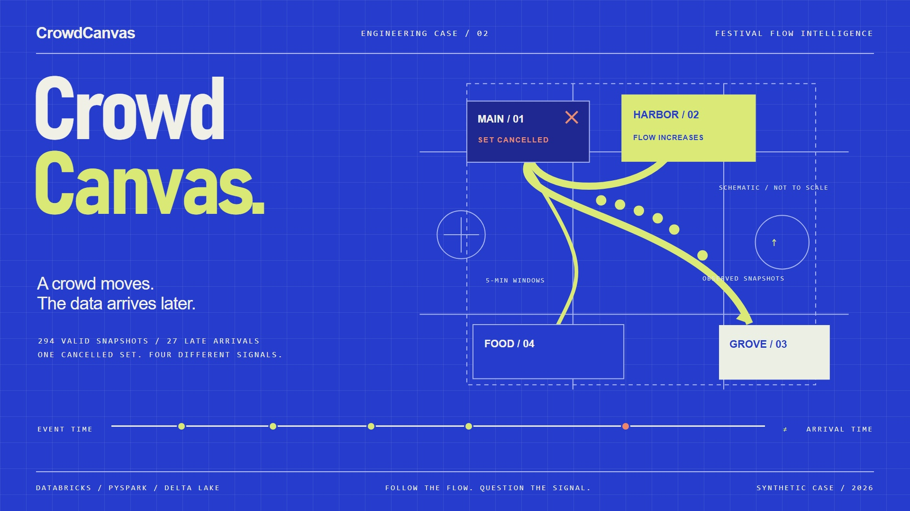

# CrowdCanvas

### Festival Flow Intelligence · Databricks + PySpark + Delta Lake

A cancelled festival set changes the pattern around Harbor, Main, Grove and the food court. CrowdCanvas analyses **anonymous occupancy snapshots, queue wait, event-time windows, delayed arrival and incomplete observations**.

[Full case JPG](docs/images/case-board.jpg) · [Case study](docs/CASE-STUDY.md) · [Offline demo](docs/demo/index.html) · [Setup](docs/SETUP.md) · [Validation](VALIDATION.md)

## Reproducible fixture

| Evidence | Result |
|---|---:|
| Raw rows → accepted snapshots | 314 → 294 |
| Duplicate payloads | 12 |
| Rejected payloads, including two conflicting versions | 8 |
| Arrivals more than 10 minutes late | 27 |
| Five-minute zone windows | 60 |
| Incomplete windows | 6 |
| Portable business tests | 14 passed |

All results are synthetic. The pressure flag is an operational demonstration heuristic, not a crowd-safety assessment. Queue changes are constructed by the fixture; they are not measured festival outcomes.

## Run locally

Python 3.10+; standard library only.

~~~shell
python scripts/generate_data.py
python -m unittest discover -s tests -v
python scripts/check_repository.py
~~~

Open [docs/demo/index.html](docs/demo/index.html) in a browser. Use the event-time slider and delayed-arrival toggle to explore corrected history. The on-time filter is not a Spark watermark simulator.

## Two data products, two time semantics

**Corrected history:** replay-safe Bronze ingestion, validation, conflicting-identity quarantine, and rebuilt Silver/Gold. All valid late observations are retained, so historical windows can incorporate information that arrived later.

**Watermarked streaming example:** consumes the curated unique JSON fixtures, uses a ten-minute watermark and five-minute event-time windows, and writes finalized windows to Delta. Older arrivals may be omitted and final windows may not be finalized until the watermark advances. Outputs are not promised to match corrected history.

| Implementation | Source |
|---|---|
| Historical PySpark/Delta pipeline | [Notebook 01](notebooks/01_corrected_history.py) |
| Separate watermarked stream | [Notebook 02](notebooks/02_watermarked_stream.py) |
| Reference policy and analysis | [Python model](src/flow_model.py) |
| Synthetic source and stream fixtures | [Generator](scripts/generate_data.py) |
| Business invariants | [14 tests](tests/test_flow_model.py) |
| Dashboard and comparison queries | [SQL](sql/dashboard.sql) |
| Computed evidence | [Reference results](data/reference_results.json) |

## Architecture

~~~mermaid
flowchart LR
    Raw[Raw synthetic CSV] --> Bronze[Payload-hash Bronze]
    Bronze --> Validate[Validate and detect identity conflicts]
    Validate --> Q[Quarantine]
    Validate --> Silver[Unique anonymous snapshots]
    Silver --> Gold[Corrected event-time windows]
    Curated[Unique curated JSON files] --> Stream[Separate watermarked stream]
    Stream --> Final[Finalized stream windows]
~~~

## Databricks execution

Upload the CSV and stream_input directory to a Unity Catalog volume; import both notebooks. Configure the catalog, schema, input paths and checkpoint path. Requires compatible Databricks compute with PySpark/Delta, volume access and table creation/write rights. Full instructions are in [setup](docs/SETUP.md).

## Verification status

**Executed locally:** 14 portable business tests and deterministic fixture generation. Source/link checks and browser verification are in [VALIDATION.md](VALIDATION.md).

**Pending:** notebook execution, watermark behavior, Delta integration, runtime privileges and SQL execution in a Databricks workspace. No actual streaming output or performance result is claimed. CI exercises the reference model, not the Databricks runtime.

[Architecture decisions](docs/ARCHITECTURE.md) · [Data contract](docs/DATA-CONTRACT.md) · [Artwork sources](docs/design/README.md) · [Contributing](CONTRIBUTING.md) · [MIT license](LICENSE)

All attendees are represented only by synthetic anonymous aggregate snapshots. No real location tracking, live sensor connector or production deployment is included.
